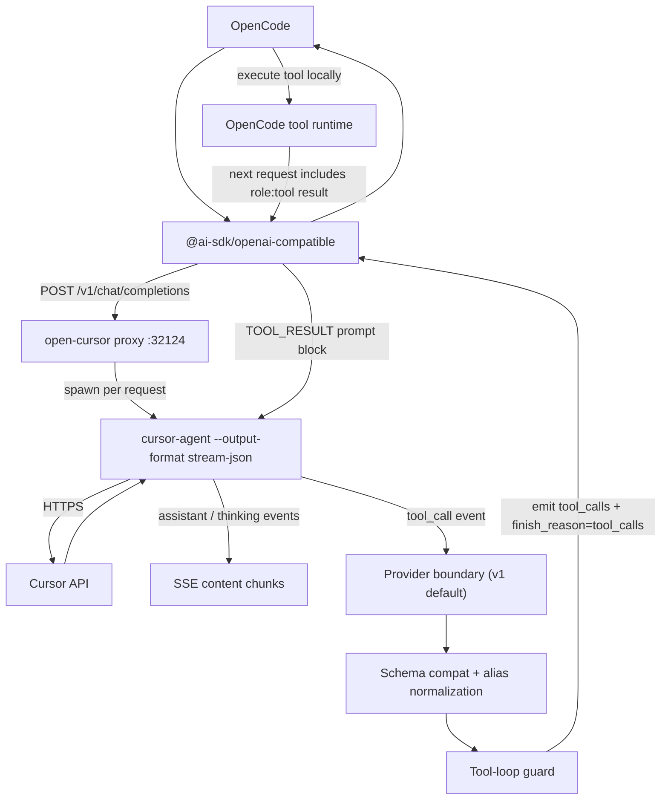

<p align="center">
  
  
</p>

No prompt limits. No broken streams. Full thinking + tool support in OpenCode. Your Cursor subscription, properly integrated.

## Prerequisites

Required: [OpenCode](https://opencode.ai/) + [cursor-agent](https://cursor.com/) (`curl -fsSL https://cursor.com/install | bash && cursor-agent login`)
Optional: [Bun](https://bun.sh/) (Options B-F), [Go 1.21+](https://go.dev/) (Option D)

## Installation

### Option A — One-line installer

```bash
curl -fsSL https://raw.githubusercontent.com/Nomadcxx/opencode-cursor/main/install.sh | bash
```

### Option B — Add to opencode.json

Add to `~/.config/opencode/opencode.json`:

```json
{
  "plugin": ["@rama_nigg/open-cursor@latest"],
  "provider": {
    "cursor-acp": {
      "name": "Cursor ACP",
      "npm": "@ai-sdk/openai-compatible",
      "models": {
        "cursor-acp/auto": { "name": "Auto" },
        "cursor-acp/composer-1.5": { "name": "Composer 1.5" },
        "cursor-acp/composer-1": { "name": "Composer 1" },
        "cursor-acp/gpt-5.3-codex": { "name": "GPT-5.3 Codex" },
        "cursor-acp/gpt-5.3-codex-low": { "name": "GPT-5.3 Codex Low" },
        "cursor-acp/gpt-5.3-codex-high": { "name": "GPT-5.3 Codex High" },
        "cursor-acp/gpt-5.3-codex-xhigh": { "name": "GPT-5.3 Codex Extra High" },
        "cursor-acp/gpt-5.3-codex-fast": { "name": "GPT-5.3 Codex Fast" },
        "cursor-acp/gpt-5.3-codex-low-fast": { "name": "GPT-5.3 Codex Low Fast" },
        "cursor-acp/gpt-5.3-codex-high-fast": { "name": "GPT-5.3 Codex High Fast" },
        "cursor-acp/gpt-5.3-codex-xhigh-fast": { "name": "GPT-5.3 Codex Extra High Fast" },
        "cursor-acp/gpt-5.2": { "name": "GPT-5.2" },
        "cursor-acp/gpt-5.2-codex": { "name": "GPT-5.2 Codex" },
        "cursor-acp/gpt-5.2-codex-high": { "name": "GPT-5.2 Codex High" },
        "cursor-acp/gpt-5.2-codex-low": { "name": "GPT-5.2 Codex Low" },
        "cursor-acp/gpt-5.2-codex-xhigh": { "name": "GPT-5.2 Codex Extra High" },
        "cursor-acp/gpt-5.2-codex-fast": { "name": "GPT-5.2 Codex Fast" },
        "cursor-acp/gpt-5.2-codex-high-fast": { "name": "GPT-5.2 Codex High Fast" },
        "cursor-acp/gpt-5.2-codex-low-fast": { "name": "GPT-5.2 Codex Low Fast" },
        "cursor-acp/gpt-5.2-codex-xhigh-fast": { "name": "GPT-5.2 Codex Extra High Fast" },
        "cursor-acp/gpt-5.1-codex-max": { "name": "GPT-5.1 Codex Max" },
        "cursor-acp/gpt-5.1-codex-max-high": { "name": "GPT-5.1 Codex Max High" },
        "cursor-acp/opus-4.6-thinking": { "name": "Claude 4.6 Opus (Thinking)" },
        "cursor-acp/sonnet-4.5-thinking": { "name": "Claude 4.5 Sonnet (Thinking)" },
        "cursor-acp/gpt-5.2-high": { "name": "GPT-5.2 High" },
        "cursor-acp/opus-4.6": { "name": "Claude 4.6 Opus" },
        "cursor-acp/opus-4.5": { "name": "Claude 4.5 Opus" },
        "cursor-acp/opus-4.5-thinking": { "name": "Claude 4.5 Opus (Thinking)" },
        "cursor-acp/sonnet-4.5": { "name": "Claude 4.5 Sonnet" },
        "cursor-acp/gpt-5.1-high": { "name": "GPT-5.1 High" },
        "cursor-acp/gemini-3-pro": { "name": "Gemini 3 Pro" },
        "cursor-acp/gemini-3-flash": { "name": "Gemini 3 Flash" },
        "cursor-acp/grok": { "name": "Grok" }
      }
    }
  }
}
```

> Update models anytime: `cursor-agent models`

### Option C — npm global + CLI

```bash
npm install -g @rama_nigg/open-cursor
open-cursor install
```

Upgrade: `npm update -g @rama_nigg/open-cursor`

### Option D — Go TUI installer

```bash
git clone https://github.com/Nomadcxx/opencode-cursor.git
cd opencode-cursor
go build -o ./installer ./cmd/installer && ./installer
```

### Option E — LLM paste

```
Install open-cursor for OpenCode: edit ~/.config/opencode/opencode.json, add "@rama_nigg/open-cursor@latest" to "plugin", add a "cursor-acp" provider with npm "@ai-sdk/openai-compatible" and models from `cursor-agent models` prefixed with "cursor-acp/". Auth: `cursor-agent login`. Verify: `opencode models | grep cursor-acp`.
```

### Option F — Manual (from source)

```bash
git clone https://github.com/Nomadcxx/opencode-cursor.git && cd opencode-cursor
bun install && bun run build
ln -sf $(pwd)/dist/plugin-entry.js ~/.config/opencode/plugin/cursor-acp.js
./scripts/sync-models.sh
```

Add `"cursor-acp"` to the `plugin` array and reuse the provider block from Option B.

## Authentication

```bash
opencode auth login   # provider id: cursor-acp
cursor-agent login    # direct
```

## Usage

```bash
opencode run "your prompt" --model cursor-acp/auto
opencode run "your prompt" --model cursor-acp/sonnet-4.5
```

## Architecture



Default mode: `CURSOR_ACP_TOOL_LOOP_MODE=opencode`. Legacy `proxy-exec` still available. Details: [docs/architecture/runtime-tool-loop.md](docs/architecture/runtime-tool-loop.md).

## Roadmap

**Phase 1 — Stabilise** *(in progress)*: Clean up dead code, fix test isolation, activate dormant ACP modules.

**Phase 2 — MCP Server**: Expose OpenCode's tools as an MCP server. cursor-agent discovers and calls them directly via `stdio` transport — no more text-embedded tool definitions.

**Phase 3 — Simplify**: With tools on MCP, rip out prompt-builder serialisation, the alias table, and most of the SSE interception layer. Plugin becomes a conversation relay.

**Phase 4 — Full ACP + MCP**: Formalise the agent boundary. SessionManager, MetricsTracker, and ToolMapper all active. Plugin is a thin ACP relay; tools flow through MCP.

## Alternatives

|                   |        open-cursor         | [yet-another-opencode-cursor-auth](https://github.com/Yukaii/yet-another-opencode-cursor-auth) | [opencode-cursor-auth](https://github.com/POSO-PocketSolutions/opencode-cursor-auth) | [cursor-opencode-auth](https://github.com/R44VC0RP/cursor-opencode-auth) |
| ----------------- | :------------------------: | :--------------------------------------------------------------------------------------------: | :----------------------------------------------------------------------------------: | :----------------------------------------------------------------------: |
| **Architecture**  | HTTP proxy via cursor-agent |                                       Direct Connect-RPC                                       |                             HTTP proxy via cursor-agent                              |                       Direct Connect-RPC/protobuf                        |
| **Platform**      |       Linux, macOS         |                                          Linux, macOS                                          |                                     Linux, macOS                                     |                          macOS only (Keychain)                           |
| **Max Prompt**    |   Unlimited (HTTP body)    |                                            Unknown                                             |                                   ~128KB (ARG_MAX)                                   |                                 Unknown                                  |
| **Streaming**     |           ✓ SSE            |                                             ✓ SSE                                              |                                     Undocumented                                     |                                    ✓                                     |
| **Error Parsing** |   ✓ (quota/auth/model)     |                                               ✗                                                |                                          ✗                                           |                              Debug logging                               |
| **Installer**     |     ✓ TUI + one-liner      |                                               ✗                                                |                                          ✗                                           |                                    ✗                                     |
| **OAuth Flow**    |  ✓ OpenCode integration    |                                            ✓ Native                                            |                                    Browser login                                     |                                 Keychain                                 |
| **Tool Calling**  | ✓ OpenCode-owned loop + proxy-exec |                                            ✓ Native                                            |                                    ✓ Experimental                                    |                                    ✗                                     |
| **Stability**     | Stable (uses official CLI) |                                          Experimental                                          |                                        Stable                                        |                               Experimental                               |
| **Dependencies**  |     bun, cursor-agent      |                                              npm                                               |                                  bun, cursor-agent                                   |                               Node.js 18+                                |
| **Port**          |           32124            |                                             18741                                              |                                        32123                                         |                                   4141                                   |

## Troubleshooting

- `fetch() URL is invalid` → `opencode auth login`
- Model not responding → `cursor-agent login`
- Quota exceeded → [cursor.com/settings](https://cursor.com/settings)
- Auth failed → `CURSOR_ACP_LOG_LEVEL=debug opencode auth login cursor-acp`

Debug logging: `CURSOR_ACP_LOG_LEVEL=debug opencode run "your prompt" --model cursor-acp/auto`

## License

BSD-3-Clause
